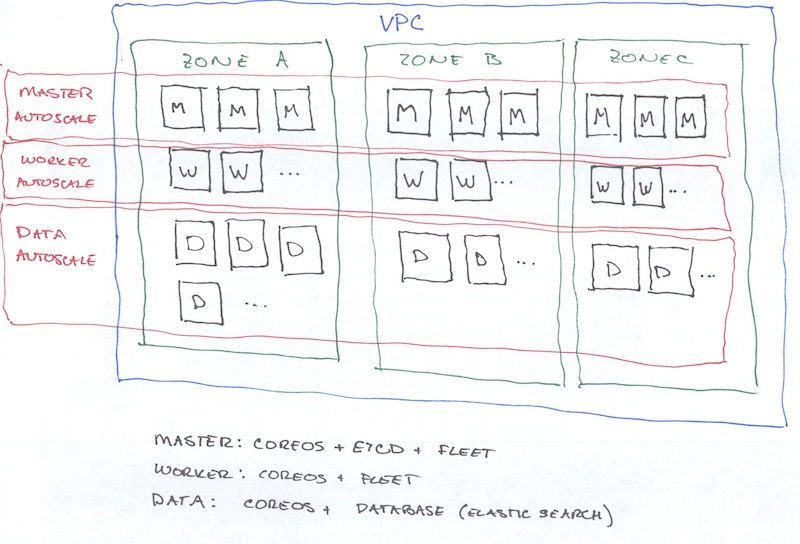

dev
===

Infrastructure for building a development and collaboration environment with
CoreOS and Docker. 

We wanted to understand what was involved in using CoreOS and Docker to provide
highly available services with AWS. While there are lots of toy examples out
there, providing real services illuminates a whole range of management and 
organization issue.

This cluster must provide a variety of services for our team:

 - Gerrit for code reviews (state is in the file system and a postgres database)
 - Buildbot for build automation (requires connection to a fleet of Windows VMs 
   hosted elsewhere, state is in the file system plus a postgres database)
 - A mediawiki instance (state is on the file system and in a ~mysql~ postgres 
   database. Sensing a pattern yet?)
 - An internal application that uses PHP (ugh) and a local database (mysql?)
 - Strong user account management, authorization and authentication. 
 - A simple internal service to upload files and email a link to the file.
 - An internal service that uses SFTP and keeps state on the local file system.
 - A number of restful services that proxy API access to other REST services.
   (We purchase access to these services but do not want to widely share the 
   authorization keys)
 - An application that lets users self-manage SSH keys for other systems and 
   allows those systems to manage user accounts.
 - We have a dynamic team that produces ad-hoc applications from time to time. 
 
In addition we have production systems that use Elasticsearch, Cassandra and
Mongodb and we want to understand how those systems might work in a 
Docker/CoreOS landscape.

Here is what the architecture looks like:

  

*Main* nodes (I accidentally wrote "master" on the drawing but I'm too lazy to 
fix it) run CoreOS and etcd and docker containers as coordinated by fleet. 
*worker* nodes are just like main nodes except they do not run etcd (they run
etcd-amb instead). *data* nodes run CoreOS but they run a dedicated task (i.e.
being an elasticsearch data node) via docker launched by systemd.

In this configuration the main nodes are in a fixed-size autoscaling (between
3 and 9 machines). The worker nodes are in an autoscaling group that can grow
and shrink as needed, possibly with automation. The data nodes are in an 
autoscaling group whose size changes manually. 

The entire configuration is described by a cloudformation document that we 
generate programmatically. 

Building Containers
-------------------

Each container has a build.sh script that can be used to build, tag and push
the container to the docker registry. 

    for container in ambassador etcd-amb presence; do
      ./$container/build.sh
    done

Cloud Formation
---------------

Cloud Formation is mechanism and format for declaring AWS resources. Rather than
hand produce a repetitive document, we have code that produces a cloudformation
document you can use to create a cluster in AWS. For convenience you can also 
build and update clusters with the tool as well. 

    cloudformation/build.py --dns-name dev.example.com \
      --key=alice@example.com \
      build

Open Issues
-----------

- A couple of times during this process, I've encountered a case where all
  etcd nodes are down and I can't figure out how to recover from this. While
  restarting the etcds they seem not to think they are really the master.

- Exactly how to get all the fleet units configured when launching a cluster or
  adding a service is still rather an open question. I'd like to figure out 
  
Configuration Notes
-------------------

Set up AWS keys:

    $ etcdctl set /secrets/aws_access_key_id XXXXXXXXXXXXXXXXXXXX
    $ etcdctl set /secrets/aws_secret_access_key yyyyyyyyyyyyyyyyyyyyyyyyyyyyyyyyyyyyyyyy
    
Set up nginx service:
    
    $ etcdctl set /services/nginx/route53_zone dev.example.com
    $ etcdctl set /services/nginx/dns_name dev.example.com
    $ etcdctl set /services/nginx/dns_ttl 300
  
Nginx self-signed certificate:

    openssl genrsa -des3 -out server.key 1024
    openssl req -new -key server.key -out server.csr
    cp server.key server.key.org
    openssl rsa -in server.key.org -out server.key
    openssl x509 -req -days 365 -in server.csr -signkey server.key -out server.crt
    cat server.crt | etcdctl set /services/nginx/ssl_cert
    cat server.key | etcdctl set /services/nginx/ssl_key
